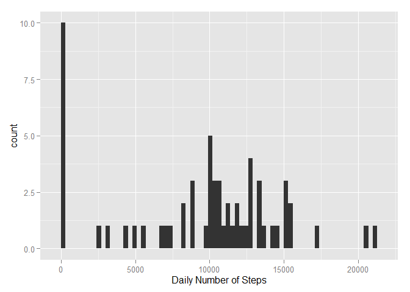
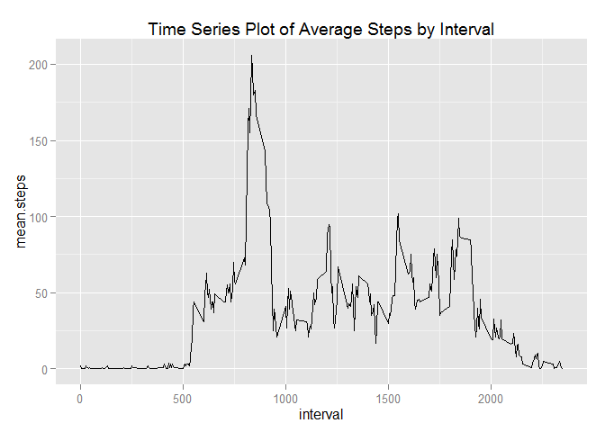
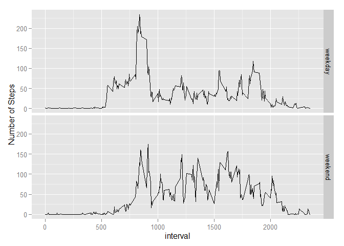

# Reproducible Research: Peer Assessment 1

## Extract contents from zip file

```r
zipFile <- 'activity.zip'
unzip(zipFile, exdir ='analysis')
```

## Loading and preprocessing the data

```r
# Load required packages
library(plyr)
library(ggplot2)

# Load the data (i.e. read.csv())
extractedFile <- '.\\analysis\\activity.csv'
activityData <- read.csv(extractedFile)
str(activityData)
```

```
## 'data.frame':	17568 obs. of  3 variables:
##  $ steps   : int  NA NA NA NA NA NA NA NA NA NA ...
##  $ date    : Factor w/ 61 levels "2012-10-01","2012-10-02",..: 1 1 1 1 1 1 1 1 1 1 ...
##  $ interval: int  0 5 10 15 20 25 30 35 40 45 ...
```

```r
# Transform data into a format suitable for analysis
activityData$date <- as.Date(activityData$date)
str(activityData)
```

```
## 'data.frame':	17568 obs. of  3 variables:
##  $ steps   : int  NA NA NA NA NA NA NA NA NA NA ...
##  $ date    : Date, format: "2012-10-01" "2012-10-01" ...
##  $ interval: int  0 5 10 15 20 25 30 35 40 45 ...
```


## What is mean total number of steps taken per day?

```r
#Calculate the total number of steps taken per day
dailysteps <- aggregate(activityData$steps, by = list(activityData$date), sum, na.rm=TRUE) 
names(dailysteps) <- c("Date", "steps")

#Make a histogram of the total number of steps taken each day
qplot(steps, data = dailysteps, geom="histogram", xlab = "Daily Number of Steps", binwidth = 300)
```

 

```r
#Calculate and report the mean and median of the total number of steps taken per day
mean.steps <- mean(dailysteps$steps) 
median.steps <- median(dailysteps$steps)
```

```
## The mean number of steps each day is 9354.23 
## The median number of steps each day is 10395
```


## What is the average daily activity pattern?


```r
#df of the mean and median number of steps taken, averaged across all days (y-axis)
intsteps <- aggregate(activityData$steps, by = list(activityData$interval), mean, na.rm=TRUE)
intstepsmed <- aggregate(activityData$steps, by = list(activityData$interval), median, na.rm=TRUE)

intsteps <- cbind(intsteps[], intstepsmed$x)

#Tidy the df names and round the numbers
names(intsteps) = c("interval","mean.steps", "median.steps")
intsteps$mean.steps <- round(intsteps$mean.steps)
intsteps$median.steps <- round(intsteps$median.steps)

ggplot(intsteps, aes(x = interval, y = mean.steps)) + 
  ggtitle("Time Series Plot of Average Steps by Interval") +
  geom_line()
```

 

```r
#Which 5-minute interval, on average across all the days in the dataset, contains the maximum number of steps?
most.steps <- intsteps$interval[intsteps$mean.steps == max(intsteps$mean.steps)]
```

```
## The interval with the most steps each day (on average is) : 835
```

## Imputing missing values

```r
#find the NAs
na.steps <- subset(activityData, is.na(steps))
num.NAs <-length(na.steps$steps)

#replace the NAs with the median number of steps for that period
nstps <- data.frame(date=activityData$date[is.na(activityData$steps)], 
                    interval = activityData$interval[is.na(activityData$steps)], 
                    steps=intsteps[match(intsteps$interval, activityData$interval[is.na(activityData$steps)]),3])

# remove the NA's from the period
activity <- subset(activityData, !is.na(steps))

# Append the median steps to the Activity DF
activity <- rbind(activityData, nstps)

#sum the number of steps each day into the dailysteps2 DF and get the mean and median 
dailysteps2 <- aggregate(activityData$steps, by = list(activityData$date), sum, na.rm=TRUE)
names(dailysteps2) <- c("Date", "steps")

qplot(steps, data = dailysteps2, geom="histogram", xlab = "Daily Number of Steps", binwidth = 300)
```

 

```r
mean.steps2 <- mean(dailysteps2$steps) 
median.steps2 <- median(dailysteps2$steps)
```

```
## There are 2304 intervals with NA
```

```
## The new mean number of steps each day is 9354.23 
## The new median number of steps each day is 10395
```


## Are there differences in activity patterns between weekdays and weekends?

```r
# Add the Weekday/weekend identifier

activityData$week <- ifelse(weekdays(activityData$date) == "Saturday" | 
                              weekdays(activityData$date) == "Sunday" ,"weekend","weekday")

#df of the mean and median number of steps taken, averaged across all days (y-axis)
intsteps2 <- aggregate(activityData$steps, by = list(activityData$week, activityData$interval), 
                       mean, na.rm=TRUE)
intstepsmed2 <- aggregate(activityData$steps, by = list(activityData$week, activityData$interval), 
                          median, na.rm=TRUE)

intsteps2 <- cbind(intsteps2[], intstepsmed2$x)

#Tidy the df names and round the numbers
names(intsteps2) = c("weekday", "interval","mean.steps", "median.steps")
intsteps2$mean.steps <- round(intsteps2$mean.steps)
intsteps2$median.steps <- round(intsteps2$median.steps)


ggplot(intsteps2, aes(x = interval, y = mean.steps)) + 
  ylab("Number of Steps") + 
  geom_line() + facet_grid(weekday~.)
```

 

As can be seen from the plots above the user appears to start walking around later at weekends (maybe they sleep later). Once they are awake they tend to take more steps and to be walking around (awake?) later in the day.
